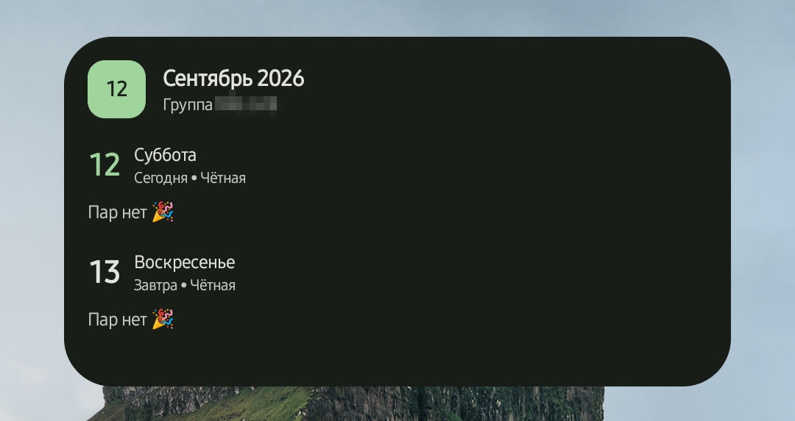
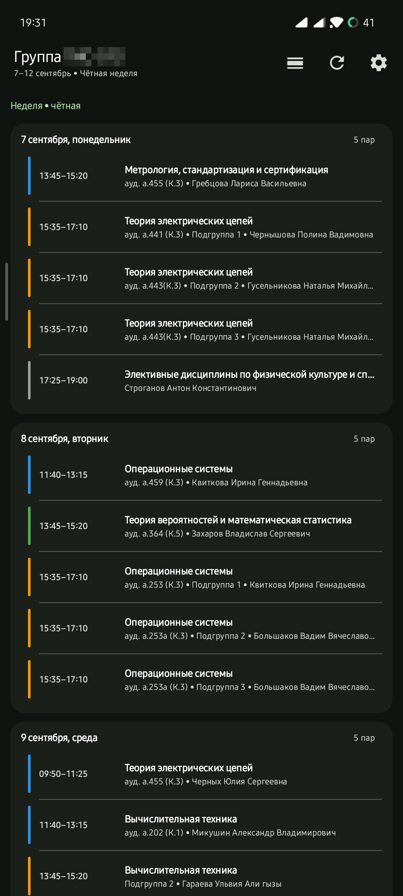
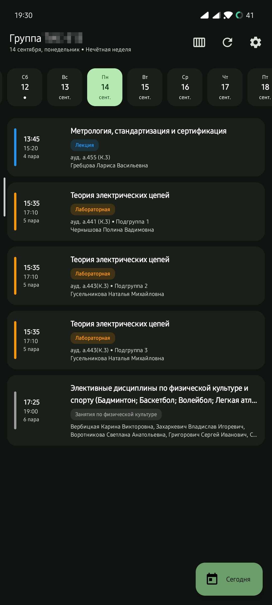
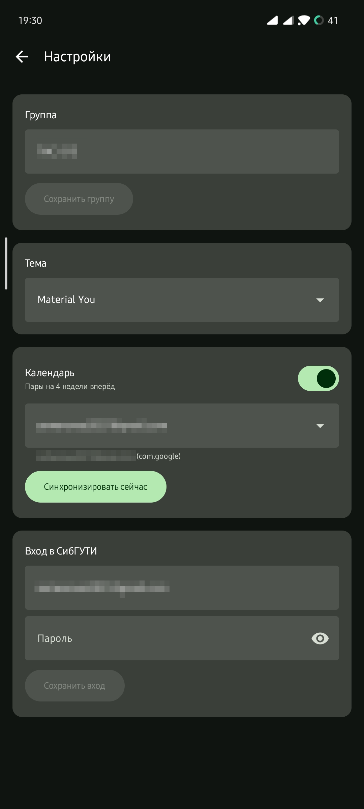

# SibSUTIS Schedule



<div align="center">



</div>

Android-приложение для просмотра расписания занятий студентов СибГУТИ
([sibsutis.ru](https://sibsutis.ru/students/schedule/)).

- Экран расписания в стиле Google Calendar: горизонтальная лента дней + свайп между датами, подсветка текущей/следующей пары
- 7 тем: Material You (dynamic colors), AMOLED, Монохром, Solarized Osaka, Gruvbox, Tokyo Night, Catppuccin Mocha
- Офлайн-кэш: Room + TTL 3 часа, расписание доступно без интернета
- Вход через личный кабинет Bitrix; логин/пароль хранятся только в `EncryptedSharedPreferences` (AES256)
- Виджет на рабочий стол (Jetpack Glance): пары на сегодня, 3 размера (включая 2×2), обновление каждые 3 часа и по кнопке
- Синхронизация с календарём устройства: пары на 4 недели вперёд, выбор календаря; Google Calendar подхватывает события через системную синхронизацию аккаунта

## Требования

- Android Studio (Arctic Fox и новее) или командная строка
- **JDK 17** (на JDK 25+ падает KSP-обработка Room; версия демона зафиксирована в `gradle/gradle-daemon-jvm.properties`)
- Android SDK с platform 37 (недостающее AGP докачает сам)

## Быстрый старт

```bash
./gradlew assembleDebug          # app/build/outputs/apk/debug/app-debug.apk
./gradlew testDebugUnitTest      # юнит-тесты (парсер, чётность недель, TTL кэша)
```

Установка на устройство:

```bash
adb install -r app/build/outputs/apk/debug/app-debug.apk
```

## Настройка в приложении

1. Настройки → **Группа** (номер/ID из URL расписания, например `3414`, или название).
2. Настройки → **Вход в СибГУТИ**: логин и пароль — без них сайт отдаёт только страницу входа (`302 → /auth/`).
3. Тема — выпадающий селектор (7 вариантов, применяется сразу, включая виджет).
4. Календарь — включи тогл, выбери календарь (для Google Calendar выбирай календарь Google-аккаунта), при первом включении выдай доступ.

## Приватность

Пароль никогда не попадает в код и логи; на устройстве — только в шифрованном хранилище.
Кэш расписания — локально в Room, наружу уходит только то, что нужно сайту вуза для выдачи расписания.

## Лицензия

MIT — см. [LICENSE](LICENSE).
